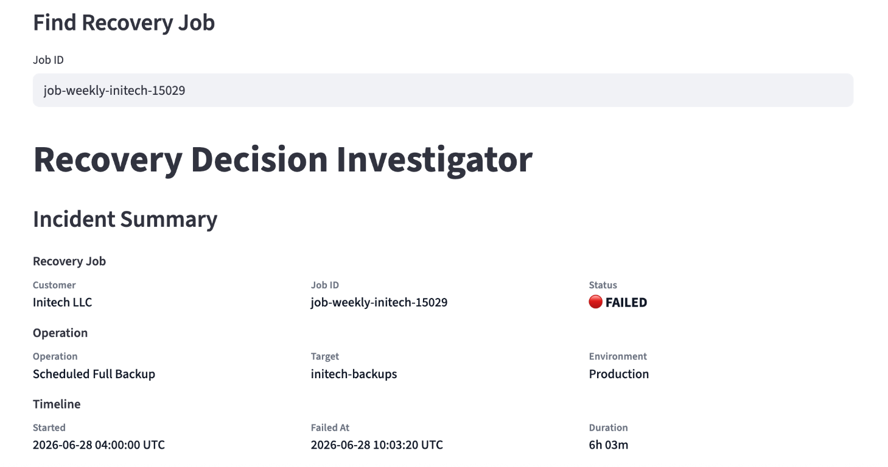
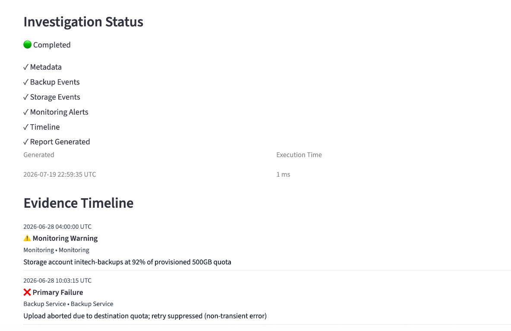
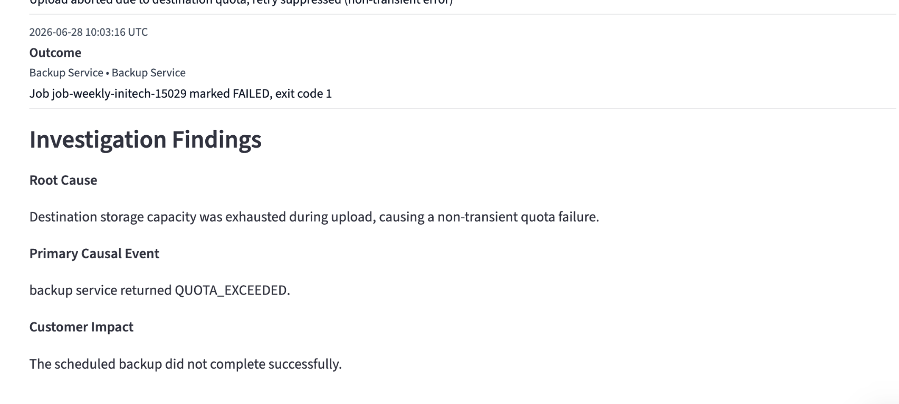
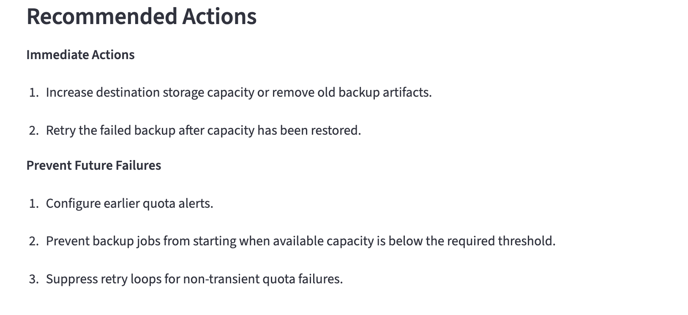
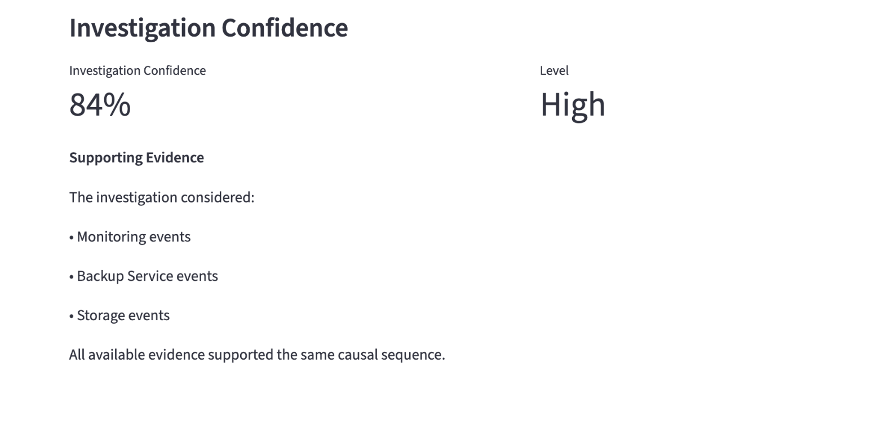

# Recovery Decision Investigator

AI-assisted root cause investigation for enterprise backup and recovery operations.

Recovery Decision Investigator is an AI-assisted investigation tool for enterprise backup and recovery operations. Given a recovery job ID, it reconstructs the event timeline, identifies the most likely root cause, and recommends next actions with an evidence-based confidence score.

## Features

- Deterministic investigation engine
- Timeline reconstruction
- Root cause analysis
- Evidence provenance
- Confidence scoring
- Recommended actions
- Optional LLM explanations

## Problem

Enterprise backup/recovery incidents typically require an engineer to manually trace logs across multiple systems (backup service, storage layer, monitoring) to reconstruct what happened. That manual investigation—reading raw logs, correlating timestamps, and forming a hypothesis—commonly takes more than 30–45 minutes per incident, even for experienced engineers.

Recovery Decision Investigator reconstructs the investigation by organizing operational evidence into a chronological timeline, identifying the most likely root cause, and presenting supporting evidence and recommended actions. An optional LLM layer generates a richer natural-language explanation while preserving the deterministic investigation.

## Why this project exists

This project explores how enterprise support engineers can shift from manually reconstructing failures to evidence-driven investigations that deliver explainable recommendations.

This project scopes that second problem narrowly and builds it end-to-end.

## Scope: what this is and isn't

**Phase 1 (built):**

- Log/event parsing across backup, storage, and monitoring sources
- Deterministic timeline reconstruction from raw events
- Rule-based root cause identification with supporting evidence
- Confidence scoring based on evidence quality (causal signal strength, cross-component corroboration, temporal coherence)

**Phase 2 (roadmap):**

- AI-generated root cause narratives (LLM-assisted, not just rule-based)
- Natural language next-action recommendations tuned to incident context
- Validation against real (anonymized) incident data, not just representative synthetic scenarios

This is not an automatic remediation system. It investigates and recommends, but it does not execute fixes.

## Architecture decision: deterministic-first, AI (optional)

The investigation engine runs in two modes:

**Deterministic mode (default):**  
Root cause and confidence are derived from rule-based analysis of the evidence timeline. No LLM call required. This means the system produces a defensible, reproducible answer even when an external AI API is unavailable, rate-limited, or intentionally disabled (for example, for cost or compliance reasons in enterprise deployments).

**Live AI mode:**  
Layers an LLM-generated narrative on top of the same underlying evidence for cases where richer natural-language reasoning adds value.

I chose deterministic-first over AI-first because, in an incident-response context, availability and explainability matter more than sophistication.

```text
Recovery Job
    │
    ▼
Evidence Collection
    │
    ▼
Event Parsing
    │
    ▼
Timeline Reconstruction
    │
    ▼
Deterministic Investigation
    │
    ▼
(Optional AI Explanation)
    │
    ▼
Investigation Report
```

## Confidence scoring

Every investigation returns a confidence score (0–100%) with a plain-language explanation of what evidence it considered.

The scoring weighs:

- Whether an exact causal error signal was identified
- Whether multiple components corroborate the same event
- Whether there is a clear temporal chain (warning → cause → outcome)
- Whether all evidence points to a single failure family vs. conflicting signals

This is a v1 heuristic rubric, not a model calibrated against labeled incident outcomes. Calibration is part of the Phase 2 roadmap once real incident data is available.

## Example scenarios covered

- Storage quota exceeded during backup (terminal failure)
- Network timeout during restore (terminal failure)
- Permission denied on restore, following an access policy change (terminal failure)
- Encryption service outage during backup with automatic recovery after retry

## Future work

- Multi-job investigation history
- Operational analytics dashboard
- Live integrations with backup and monitoring systems
- Exportable investigation reports

## Tech stack

- Python
- Streamlit
- OpenAI API (optional)
- JSON-based synthetic incident scenarios
- Pytest

## Running locally

```bash
# clone
git clone https://github.com/<your-username>/<repo-name>.git
cd <repo-name>

# install
pip install -r requirements.txt

# configure
cp .env.example .env
# add your API key if using Live AI mode

# run
streamlit run recovery_workspace/app.py
```

## Screenshots

### Job Search & Incident Summary



### Investigation Status & Evidence Timeline



### Investigation Findings



### Recommended Actions



### Investigation Confidence


